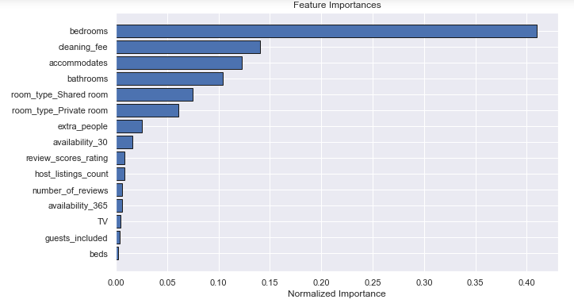
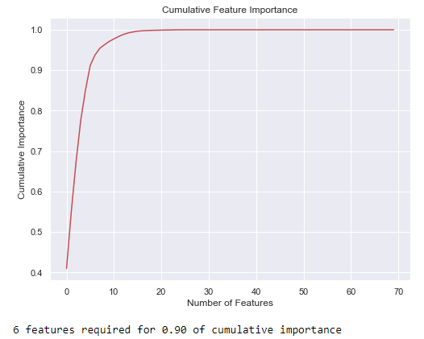
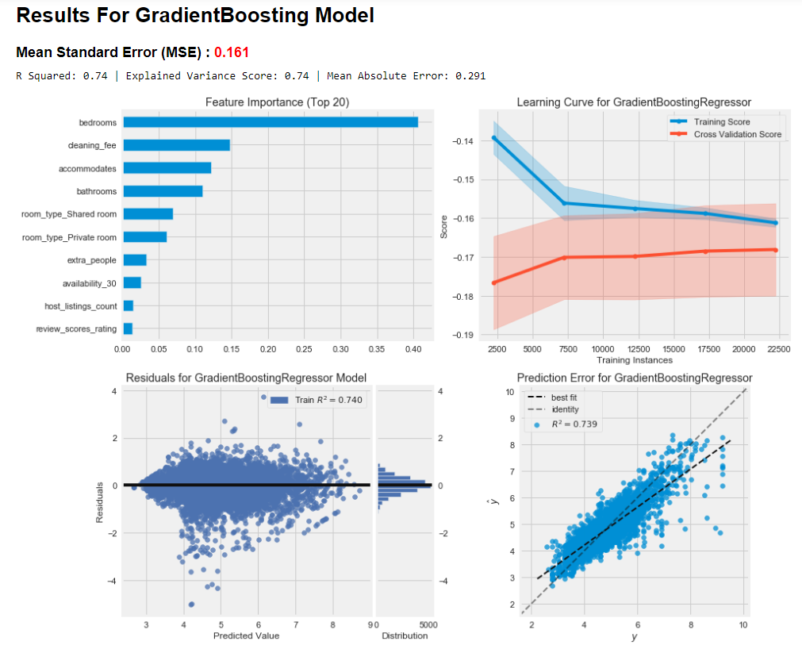
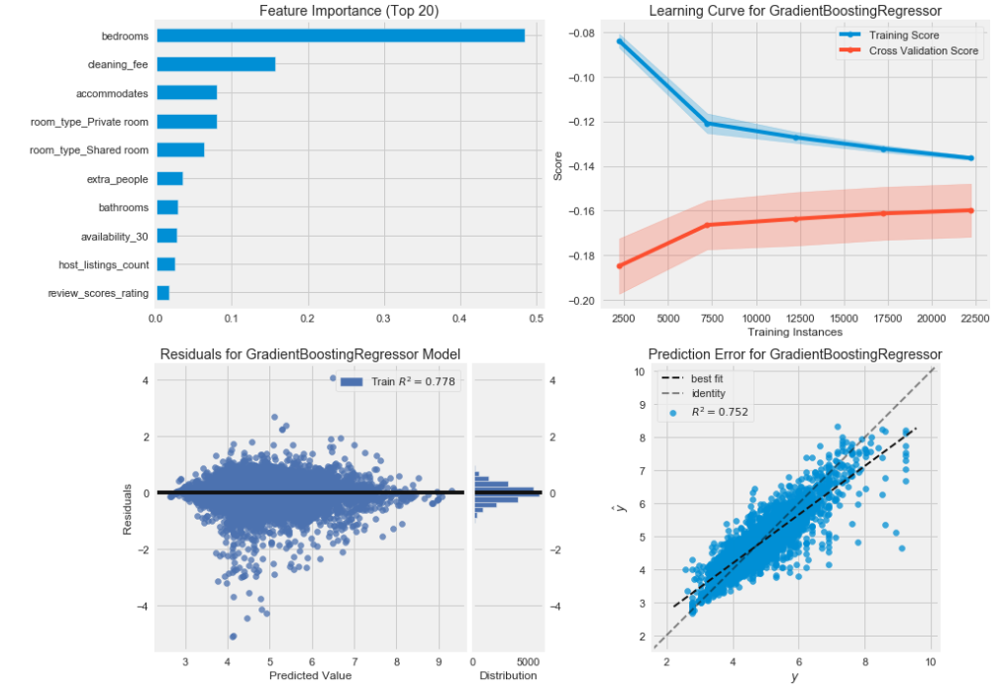

 Airbnb is a popular and fast-growing alternative to traditional lodging options. It opened in 2008 in San Francisco California and quickly grew around the world. Los Angeles California is a diverse and popular destination with multiple amusement parks, beaches, and outdoor locations offering people many reasons to visit the area. With the rise in the sharing economy, Airbnb has the potential to offer both customers and hosts more choices.

The purpose of this project is to predict listing price based on several possible features available from data collected through [Inside Airbnb](http://insideairbnb.com/get-the-data.html). This high-level overview will showcase my work with the data while there will be links to the specific notebooks with all the work completed to achieve project results.

***
## Initial Cleaning

### Findings
* Many columns have missing data and four columns have more than 90% of values missing
* Four other columns had only one unique values

### Actions
* I will removed these columns that have more than 90% of values missing. Other columns with missing data will be handled later with imputation
* I removed columns 'experiences_offered', 'country_code', 'country', 'has_availability' due to having only one unique value
* Converted all the columns to appropriate data type
* Changed T/F columns to binary
* Cleaned the currency related fields, zipcodes, and percentage columns
* Removed listings with $500 or more daily price. Around 95% of listings are below this amount
***

## Data Exploration

### Findings
* Most hosts respond within an hour
* Most hosts are neither verified or superhosts
* Bed type, requires license, and host has a profile pic are not a useful field
* There are a handful of features that are correlated with price
* A few features are highly correlated with each other
* The target variable is skewed and will need to be log transformed 

***

## Feature Selection

### Findings
* The wireless accommodation category has a low correlation
* Bedrooms are the most important feature

### Actions
* Created a variable for when a security deposit is required
* Bundled misc property types in 'other' category
* Created new features based on the amenities text field
* Removed 'zipcode', 'availability_60', 'availability_90', 'bed_type', 'host_has_profile_pic', 'requires_license'
* One-hot-encoded all categorical features
* Imputed all missing values with the median value
* Log transformed the price target
* I used step forward feature selection to choose 10 features

***

## Initial Model Development
### Feature Selection (Step Forward)
| Model | R2 | RMSE | Median Absolute Error |
| :---: | :---: | :---: | :---: |
| Linear Regression | .741 | $52.00 | 19.7 |
| Random Forest | .742 | $49.10 | 20.1 |
| Gradient Boosted | .812 | $42.90 | 16.8 |
| Light GBM | .852 | $38.20 | 15.0 |

### All Features
| Model | R2 | RMSE | Median Absolute Error |
| :---: | :---: | :---: | :---: |
| Linear Regression | .780 | $47.60 | 17.7 |
| Random Forest | .744 | $48.80 | 20.0 |
| Gradient Boosted | .823 | $41.90 | 16.1 |
| Light GBM | .876 | $35.20 | 13.4 |

### Best Performing Model

## Final Model Development

### Feature Selection (Step Forward)
| Model | R2 | RMSE | Median Absolute Error |
| :---: | :---: | :---: | :---: |
| Gradient Boosted | .807 | $44.31 | 17.1 |
| Light GBM | .809 | $44.03 | 15.9 |

### All Features
| Model | R2 | RMSE | Median Absolute Error |
| :---: | :---: | :---: | :---: |
| Gradient Boosted | .819 | $43.02 | 16.8 |
| Light GBM | .825 | $42.15 | 15.2 |

### Optimized Model

## Natural Language Processing

### With NLP & Feature Selection (Step Forward)
| Model | R2 | RMSE | Median Absolute Error |
| :---: | :---: | :---: | :---: |
| Linear Regression | .731 | $52.90 | 20.1 |
| Random Forest | .739 | $49.30 | 20.2 |
| Gradient Boosted | .812 | $43.00 | 16.7 |
| Light GBM | .854 | $37.90 | 14.7 |

### Optimized
| Model | R2 | RMSE | Median Absolute Error |
| :---: | :---: | :---: | :---: |
| Gradient Boosted | .807 | $44.02 | 15.9 |
| Light GBM | .809 | $43.67 | 15.7 |

### With NLP & All Features
| Model | R2 | RMSE | Median Absolute Error |
| :---: | :---: | :---: | :---: |
| Linear Regression | .783 | $47.40 | 17.4 |
| Random Forest | .744 | $48.80 | 20.0 |
| Gradient Boosted | .824 | $41.70 | 16.0 |
| Light GBM | .877 | $35.00 | 13.3 |

### Optimized
| Model | R2 | RMSE | Median Absolute Error |
| :---: | :---: | :---: | :---: |
| Gradient Boosted | .807 | $44.02 | 15.9 |
| Light GBM | .809 | $43.67 | 15.7 |

## Conclusion

## Notebooks
1. [Initial Cleaning](https://github.com/csmangum/portfolio/blob/master/Airbnb%20Price%20Prediction/1.%20Initial%20Cleaning.ipynb)
2. [Data Exploration](https://github.com/csmangum/portfolio/blob/master/Airbnb%20Price%20Prediction/2.%20Data%20Exploration.ipynb)
3. [Preprocessing](https://github.com/csmangum/portfolio/blob/master/Airbnb%20Price%20Prediction/3.%20Preprocessing.ipynb) 
4. [Feature Selection](https://github.com/csmangum/portfolio/blob/master/Airbnb%20Price%20Prediction/4.%20Feature%20Selection.ipynb)
5. [Model Selection and Optimization](https://github.com/csmangum/portfolio/blob/master/Airbnb%20Price%20Prediction/5.%20Model%20Selection%20%26%20Optimization.ipynb) 
