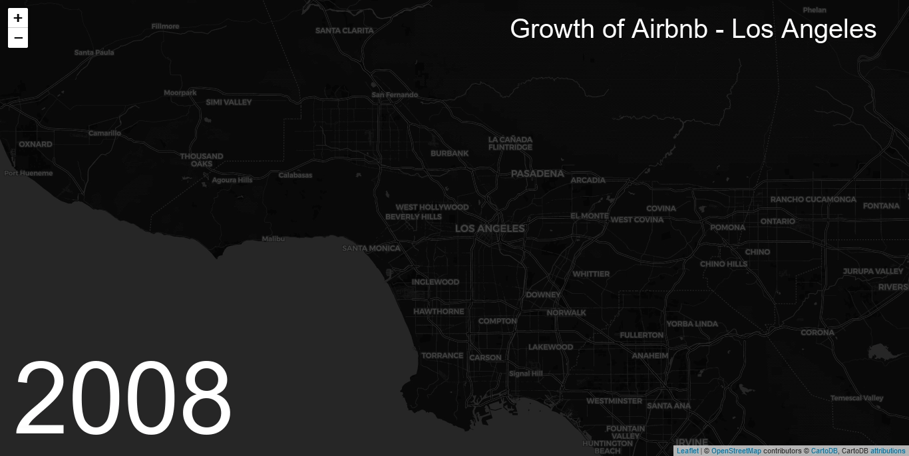

# Predict Airbnb Listing Price
Airbnb is a popular and fast-growing alternative to traditional lodging options. It opened in 2008 in San Francisco California and quickly grew around the world. Los Angeles California is a diverse and popular destination with multiple amusement parks, beaches, and outdoor locations offering people many reasons to visit the area. With the rise in the sharing economy, Airbnb has the potential to offer both customers and hosts more choices.

The purpose of this project is to predict listing price based on several possible features available from data collected through [Inside Airbnb](http://insideairbnb.com/get-the-data.html). This high-level overview will showcase my work with the data while there will be links to the specific notebooks with all the work completed to achieve project results.

***
## Initial Cleaning

### Findings
* Many columns have missing data and four columns have more than 90% of values missing
* Four other columns had only one unique values

### Actions
* I will removed these columns that have more than 90% of values missing. Other columns with missing data will be handled later with imputation
* I removed columns 'experiences_offered', 'country_code', 'country', 'has_availability' due to having only one unique value
* Converted all the columns to appropriate data type
* Changed T/F columns to binary
* Cleaned the currency related fields, zipcodes, and percentage columns
* Removed listings with $600 or more daily price. Around 95% of listings are below this amount
***

## Data Exploration

***

## Feature Selection

***

## Model Development
### Initial Model

### Optimized Model

## Conclusion

## Notebooks
1. [Initial Cleaning](https://github.com/csmangum/portfolio/blob/master/Airbnb%20Price%20Prediction/1.%20Initial%20Cleaning.ipynb)
2. [Data Exploration](https://github.com/csmangum/portfolio/blob/master/Airbnb%20Price%20Prediction/2.%20Data%20Exploration.ipynb)
3. [Preprocessing](https://github.com/csmangum/portfolio/blob/master/Airbnb%20Price%20Prediction/3.%20Preprocessing.ipynb) 
4. [Feature Selection](https://github.com/csmangum/portfolio/blob/master/Airbnb%20Price%20Prediction/4.%20Feature%20Selection.ipynb)
5. [Model Selection and Optimization](https://github.com/csmangum/portfolio/blob/master/Airbnb%20Price%20Prediction/5.%20Model%20Selection%20%26%20Optimization.ipynb) 
